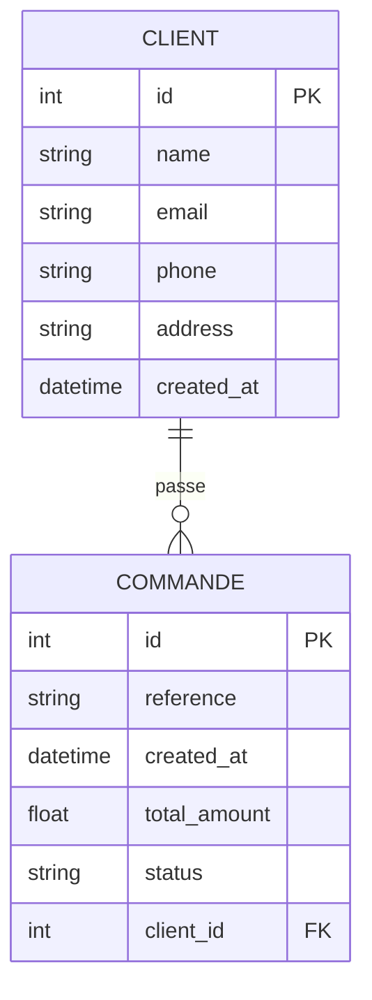

# Suivi de commandes — Citerneo

Application web de gestion de clients et de commandes, construite avec FastAPI, HTMX et SQLite.

---

## Prérequis

- Python 3.11+
- [uv](https://docs.astral.sh/uv/) (gestionnaire de paquets)

## Installation et lancement

```bash
# Cloner le dépôt puis :
uv run uvicorn main:app --reload
```

Ouvrir ensuite `http://127.0.0.1:8000` dans le navigateur.  
La base de données et les données de démonstration sont créées automatiquement au premier démarrage.

---

## Stack technique

### Serveur web — Uvicorn + FastAPI

**Uvicorn** est le serveur web qui reçoit les requêtes HTTP et les transmet à l'application.  
C'est un serveur ASGI (*Asynchronous Server Gateway Interface*), le standard Python pour les applications web asynchrones.

**FastAPI** est le framework qui définit les routes (`GET /clients/`, `POST /commandes/`, etc.),
valide les données entrantes via Pydantic, et construit les réponses.

```
Navigateur → Uvicorn → FastAPI → Route → Base de données
                                       ↓
Navigateur ← HTML/JSON ←←←←←←←←←←←←←←←
```

La commande `--reload` demande à Uvicorn de redémarrer automatiquement quand un fichier Python change — utile en développement uniquement.

### Base de données — SQLite + SQLModel

**SQLite** est une base de données relationnelle stockée dans un simple fichier (`database.db`).  
Pas de serveur à installer, idéal pour le développement et les petites applications.

**SQLModel** est la bibliothèque qui fait le lien entre Python et SQLite.  
Elle permet de définir les tables comme des classes Python :

```python
class Client(SQLModel, table=True):
    id: Optional[int] = Field(default=None, primary_key=True)
    name: str
    email: str
    ...
```

SQLModel génère automatiquement les requêtes SQL (`SELECT`, `INSERT`, etc.).

### Relation entre les tables

Un client peut avoir plusieurs commandes (relation **1-N**) :

```
CLIENT ──────────── COMMANDE
  id  ←──── client_id (clé étrangère)
  name           reference
  email          total_amount
  ...            status
```

Si un client est supprimé, toutes ses commandes le sont aussi (`CASCADE`).

### Interface — Jinja2 + HTMX

**Jinja2** est le moteur de templates : FastAPI lui passe des données Python, il génère du HTML.

**HTMX** est une bibliothèque JavaScript légère qui permet de faire des requêtes HTTP depuis le HTML, sans écrire de JavaScript. Par exemple :

```html
<!-- Ce formulaire envoie une requête POST et remplace #client-list avec la réponse -->
<form hx-post="/clients/" hx-target="#client-list" hx-swap="outerHTML">
```

HTMX évite le rechargement complet de la page. Quand on change le statut d'une commande, seule la ligne du tableau est mise à jour — pas toute la page.

### Validation — Pydantic

Toutes les données entrantes (formulaires) sont validées avant insertion en base :

| Champ | Validation |
|---|---|
| Email | Format valide (`user@domaine.fr`) |
| Téléphone | Format français (`0612345678`, `+33612345678`) |
| Adresse | Doit commencer par un numéro de rue |
| Montant | Strictement positif |
| Statut | Dans la liste autorisée uniquement |

En cas d'erreur, l'API retourne un `422 Unprocessable Entity` avec le détail du problème.

---

## Structure du projet

```
projet_test_citerneo/
├── main.py                  # Point d'entrée : init DB, seed, routes
├── pyproject.toml           # Dépendances (géré par uv)
├── database.db              # Fichier SQLite (créé au premier lancement)
├── app/
│   ├── config.py            # Configuration Jinja2
│   ├── database.py          # Connexion SQLite
│   ├── schemas.py           # Validation Pydantic des entrées
│   ├── models/
│   │   ├── client.py        # Modèle Client (table SQL)
│   │   └── commande.py      # Modèle Order + enum OrderStatus
│   └── routes/
│       ├── clients.py       # GET/POST/DELETE /clients/
│       └── commandes.py     # GET/POST/PATCH /commandes/
└── templates/
    ├── base.html            # Layout commun (nav, CSS, HTMX)
    ├── clients/
    │   ├── index.html       # Page liste + formulaire clients
    │   ├── _list.html       # Fragment HTMX : tableau clients
    │   └── commandes.html   # Page commandes d'un client
    └── commandes/
        ├── index.html       # Page liste + formulaire commandes
        ├── _list.html       # Fragment HTMX : tableau commandes
        └── _row.html        # Fragment HTMX : une ligne (statut)
```

## Architecture Base de données



---

## Usage de l'IA

Ce projet a été développé avec l'assistance de Claude (Anthropic).

L'IA a été utilisée pour :
- Générer la structure initiale des fichiers et des routes FastAPI
- Déboguer les erreurs (import circulaire sur les modèles SQLModel, changement d'API Starlette pour `TemplateResponse`, problème N+1 sur les requêtes)
- Écrire les templates HTMX/Jinja2

La relecture, les choix d'architecture (séparation routes/modèles/schémas, cascade sur suppression, activation des clés étrangères SQLite) et les ajustements de validation ont été faits manuellement.
