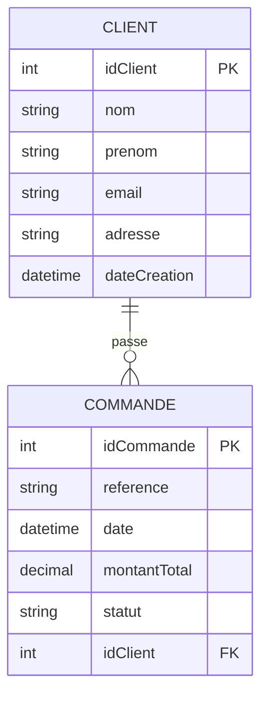

# Projet Citerneo

Ce projet est une application Python basée sur FastAPI et SQLModel pour la gestion d'un système de commandes et de clients.

## Structure du projet

- `main.py` : point d'entrée de l'application.
- `app/database.py` : configuration de la base de données.
- `app/models/client.py` : modèle de données pour les clients.
- `app/models/commande.py` : modèle de données pour les commandes.
- `app/routes/` : routes et points d'API.
- `app/static/` : fichiers statiques.
- `app/templates/` : templates Jinja pour les vues.

## Architecture Base de données


## Prérequis

- Python 3.14+
- Un environnement virtuel recommandé

## Installation

3. Installez les dépendances du projet :

```powershell
uv install
```

## Lancement

```powershell
uvicorn main:app --reload
```

Puis ouvrez `http://127.0.0.1:8000` dans votre navigateur.

## Notes

- Vérifiez `pyproject.toml` pour la configuration des dépendances.
- Adaptez les routes et templates selon vos besoins métiers.


